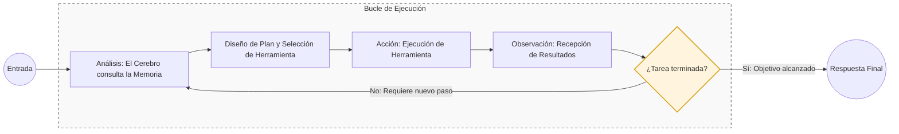
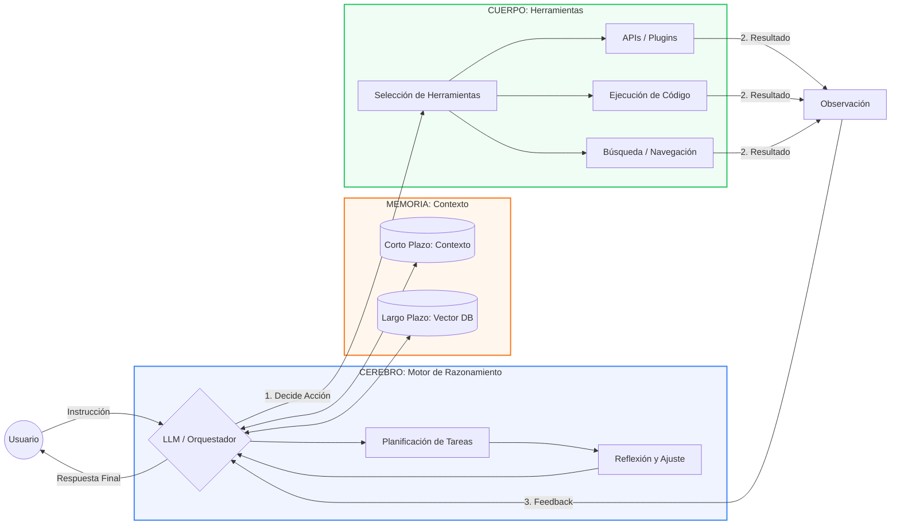
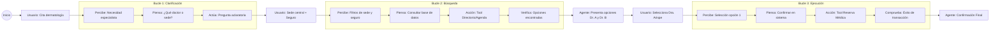

Este documento contempla la _arquitectura de agentes de IA_ basado en tres componentes como **el cerebro**, **la memoria** y **las herramientas** - patrón **"Brain-Body-Tools"**.

## Contenido
- [Arquitectura de agentes de IA](#arquitectura-de-agentes-de-IA)
- [El Flujo de Trabajo](#el-flujo-de-trabajo)
- [Arquitectura Brain Body Tools](#Arquitectura-Brain-Body-Tools)
- [Caso practico](#caso-practico)
- [Resumen](#Resumen)

---
# Arquitectura de agentes de IA

La arquitectura de agentes de IA de tres componentes, normalmente está basado en el patrón **"Brain-Body-Tools"** o el modelo de **"Razonamiento, Memoria y Acción"**, es el estándar actual para diseñar sistemas autónomos capaces de resolver tareas complejas.

A diferencia de un chatbot tradicional, un agente IA orientado basicamente en tres componentes (cerebro, memoria y herramientas) no solo responde, sino que procesa información y ejecuta cambios en su entorno.

---

## 1. El Cerebro (Modelo de Lenguaje / Razonamiento)
Este es el núcleo del agente, generalmente compuesto por un LLM (Large Language Model) avanzado. Su función no es solo generar texto, sino actuar como el motor de razonamiento lógico.

*   **Planificación:** Descompone una meta ambiciosa en pasos lógicos menores.
*   **Reflexión:** Evalúa si sus pasos anteriores fueron exitosos y corrige el rumbo si es necesario.
*   **Selección de Herramientas:** Decide qué recurso externo necesita para completar una tarea (por ejemplo, "¿Debo buscar en internet o calcular esto matemáticamente?").

## 2. La Memoria (Contexto y Persistencia)
Sin memoria, un agente olvidaría el primer paso de su plan al llegar al segundo. Se divide principalmente en dos tipos:

*   **Memoria de Corto Plazo:** Utiliza la "ventana de contexto" del modelo para mantener el hilo de la conversación actual y los pasos de ejecución inmediatos.
*   **Memoria de Largo Plazo:** Normalmente implementada mediante una **Base de Datos Vectorial**. Permite al agente recuperar documentos, datos históricos o preferencias del usuario que no caben en la ventana de contexto inmediata.

## 3. Las Herramientas o Acción (Interface/Herramientas)
Es el componente que permite al agente interactuar con el mundo real. Transforma el razonamiento en ejecución.

*   **APIs y Plugins:** Capacidad para conectarse a calendarios, CRMs, servicios de clima o bases de datos internas.
*   **Ejecución de Código:** Algunos agentes pueden escribir y ejecutar scripts de Python en un entorno seguro para realizar análisis de datos complejos.
*   **Navegación Web:** Herramientas para buscar información actualizada en tiempo real que no estaba presente en su entrenamiento original.

---

La arquitectura de agentes de IA de tres componentes, a menudo referida como el patrón **"Brain-Body-Tools"** o el modelo de **"Razonamiento, Memoria y Acción"**, es el estándar actual para diseñar sistemas autónomos capaces de resolver tareas complejas.

A diferencia de un chatbot tradicional, un agente de tres componentes no solo responde, sino que procesa información y ejecuta cambios en su entorno.

---

# El Flujo de Trabajo

El funcionamiento sigue un ciclo continuo conocido habitualmente como el bucle (Loop de Ejecución) **Percepción-Planificación-Acción**:

1.  **Entrada:** El usuario da una instrucción.
2.  **Análisis:** El **Cerebro** consulta la **Memoria** para entender el contexto y diseña un plan.
3.  **Acción:** El agente selecciona una **Herramienta** y la ejecuta.
4.  **Observación:** El agente recibe el resultado de la herramienta (ej. un error de API o una respuesta exitosa).
5.  **Iteración:** El Cerebro evalúa el resultado y decide si la tarea ha terminado o si requiere un nuevo paso.

Esta estructura permite que el sistema sea mucho más que una interfaz de preguntas y respuestas, convirtiéndolo en un colaborador capaz de gestionar flujos de trabajo de principio a fin.

---
# Arquitectura Brain Body Tools

Aquí tienes la representación del patrón **Brain-Body-Tools** (Razonamiento, Memoria y Acción), se muestra la conexión entre los principales componentes:

## Descripción del Flujo:
*   **Cerebro (Razonamiento):** Recibe la entrada y utiliza el LLM para planificar los pasos necesarios.
*   **Memoria (Contexto):** El cerebro consulta constantemente la memoria de corto plazo (historial de chat) y la de largo plazo (datos técnicos o históricos) para dar sentido a la instrucción.
*   **Cuerpo (Acción):** El cerebro envía comandos a las herramientas externas (APIs, scripts o búsquedas web).
*   **Observación (Loop):** El resultado de estas herramientas vuelve al cerebro, que reflexiona si el objetivo se ha cumplido o si debe iterar nuevamente.

# Caso practico

Este es un ejemplo de flujo de trabajo para un Agente de IA diseñado para la **gestión de citas médicas**, siguiendo la estructura de **Percepción, Razonamiento y Acción** del patrón **Brain-Body-Tools**:

**Usuario:** "Necesito una cita con un dermatólogo para esta semana."

**Iteración del bucle 1:**
*   **Percibe:** El usuario solicita una cita de dermatología para la semana actual.
*   **Piensa:** El sistema tiene varios especialistas en dermatología. Necesito identificar si el usuario prefiere a alguien en particular o una ubicación específica, y verificar su seguro médico.
*   **Actúa:** Hace una pregunta aclaratoria sobre preferencia de médico o sede.
*   **Comprueba:** No realizado - se requiere respuesta del usuario.

**Usuario:** "En la sede central y que atienda por mi seguro regular."

**Iteración del bucle 2:**
*   **Percibe:** Sede central, cobertura mediante seguro registrado.
*   **Piensa:** Debo consultar la base de datos de proveedores para filtrar dermatólogos en la sede central que acepten su seguro y luego revisar sus agendas.
*   **Acción:** Usa la herramienta de **Directorio Médico + Agenda** → Devuelve: "Dra. Arispe disponible jueves 10:00 AM y Dr. Torres disponible viernes 3:00 PM."
*   **Verifica:** No realizado - tengo horarios pero el usuario debe elegir.

**Iteración del bucle 3:**
*   **Percibe:** Disponibilidad encontrada para jueves y viernes.
*   **Piensa:** Presentar las opciones al usuario de forma clara para su elección.
*   **Acción:** Genera respuesta con opciones.
*   **Comprueba:** No realizado - el usuario debe decidir.

**Agente:** "Tengo dos opciones disponibles en la sede central con tu seguro:
1. Dra. Arispe: Jueves a las 10:00 AM.
2. Dr. Torres: Viernes a las 3:00 PM.
¿Cuál prefieres agendar?"

**Usuario:** "La del jueves con la Dra. Arispe."

**Iteración del bucle 4:**
*   **Percibe:** El usuario seleccionó la opción 1 (Dra. Arispe, jueves 10:00 AM).
*   **Piensa:** Procede a bloquear el cupo en el sistema de gestión hospitalaria y generar la orden de atención.
*   **Acción:** Usa la herramienta de **Reserva Médica** → Reserva confirmada; ID de cita #8829.
*   **Comprueba:** Objetivo alcanzado - cita reservada exitosamente.

**Agente:** "¡Confirmado! Tu cita con la Dra. Arispe en la sede central ha sido programada para este jueves a las 10:00 AM. Te he enviado los detalles y las indicaciones previas a tu correo electrónico."

## Flujo Agente IA - Gestión de citas médicas

La representación del flujo de reserva de la cita médica donde se visualiza el ciclo de razonamiento del agente:

### Notas sobre el diseño del flujo:
*   **Nodos de Decisión:** Cada bloque de "Piensa" actúa como el cerebro del agente, evaluando si tiene información suficiente para pasar a la acción o si debe volver al usuario.
*   **Interacción con Herramientas:** Las acciones en los bucles 2 y 3 representan las llamadas a APIs externas (Directorio y Sistema de Reservas).
*   **Validación:** El paso de "Comprueba/Verifica" asegura que el agente no asuma que la tarea terminó hasta recibir una confirmación del sistema o del usuario.

# Resumen

La arquitectura de agentes de IA basada en el patrón **Brain-Body-Tools** representa el salto evolutivo de los simples chatbots hacia colaboradores autónomos capaces de razonar y ejecutar. En lugar de solo predecir palabras, este diseño estructurado permite que la tecnología entienda objetivos complejos, maneje datos persistentes e interactúe con el mundo real mediante acciones concretas. Es el marco ideal para empresas que buscan transformar procesos operativos en experiencias fluidas y eficientes.

El **Cerebro** funciona como el motor de razonamiento lógico, descomponiendo metas en pasos manejables. La **Memoria** actúa como el repositorio de contexto, recordando tanto el hilo de la conversación actual como datos históricos cruciales para la personalización. Finalmente, el **Cuerpo** es la interfaz de ejecución que utiliza **Herramientas** como APIs o bases de datos para realizar tareas que un modelo de lenguaje, por sí solo, no podría completar.

El **Flujo de Trabajo** sigue un bucle continuo de **Percepción, Planificación, Acción y Observación**. El agente recibe una instrucción, analiza el contexto en su memoria, diseña un plan de ataque, ejecuta la acción a través de sus herramientas y observa el resultado para decidir si el objetivo se ha cumplido o si debe iterar con un nuevo enfoque. Esta capacidad de autorreflexión asegura una precisión excepcional en cada tarea.

En la **gestión de citas médicas**, este patrón brilla con total claridad. Cuando un paciente solicita una consulta, el **Cerebro** identifica la especialidad necesaria; la **Memoria** valida los datos del seguro y sedes preferidas; y las **Herramientas** consultan la agenda en tiempo real para ofrecer opciones disponibles. El resultado no es solo una respuesta automática, sino una transacción completada con éxito que ahorra tiempo administrativo y mejora la atención al paciente. Adoptar esta arquitectura es apostar por una inteligencia que no solo habla, sino que resuelve.

---

*Documentación elaborado por [Hadson Paredes](https://www.linkedin.com/in/hadson-paredes/) - 2026*
- Repositorio [Python-LangChain-Learning](https://github.com/devhadson/Python-LangChain-Learning/lcel-triaje-medico-base)
- Disponible como curso en [Hadson.Tech](https://hadson.tech/cursos-disponibles/python-langChain)

<h4 align="center"> Publicaciones en mis redes sociales y reposotorio GitHub</h4>

  <h3>Sígueme en mis redes sociales</h3>
  
  
  
  

