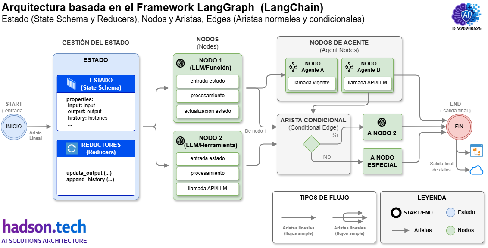
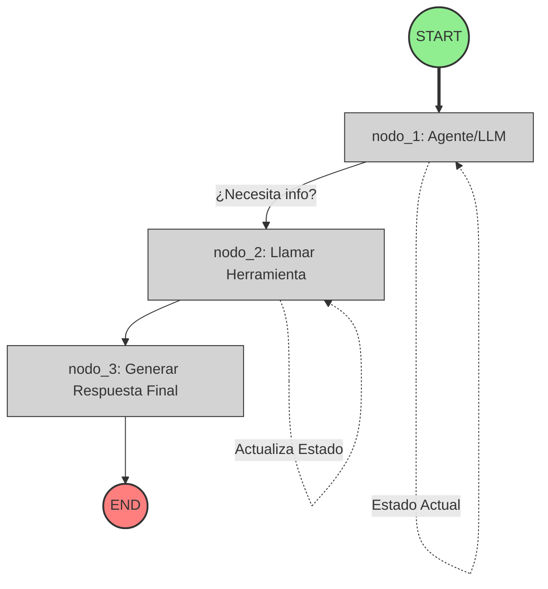

# Sistemas agénticos mediante el uso de grafos

Diseñar sistemas agénticos complejos mediante el uso de grafos es uno de los enfoques más robustos en la actualidad para superar las limitaciones de los agentes secuenciales básicos. Al modelar el comportamiento de los agentes como un **Grafo Dirigido (DAG o con ciclos)**, ganamos control total sobre los flujos de decisión, la persistencia del estado y la resiliencia del sistema agéntico.

# LangGraph

Es importante mencionar a la **LangGraph** para lograr este comportamiento de los agentes como un **Grafo Dirigido (DAG o con ciclos)**. **LangGraph** es un framework de código abierto desarrollado por **LangChain** diseñado para construir aplicaciones basadas en _agentes de **Inteligencia Artificial** utilizando estructuras de grafos_. A diferencia de los flujos secuenciales o lineales tradicionales, permite crear bucles, ciclos y retroalimentaciones interactivas. Esto lo convierte en la herramienta ideal para diseñar sistemas agentic complejos, asistentes multitarea y flujos multiagente avanzados.

## 1. Fundamentos Arquitectónicos: El Triángulo de LangGraph

Para construir un sistema complejo, debemos entender sus tres pilares fundamentales:

* **El Estado (`State`):** Es la fuente única de verdad que se pasa entre los nodos.
* **Los Nodos (`Nodes`):** Son las unidades de ejecución (funciones de Python).
* **Las Aristas (`Edges`):** Definen los flujos que puede ser fijas o dinámica.

    

### Componentes base de un Grafo en LangGraph
Cualquier arquitectura desarrollada en LangGraph se fundamenta en tres pilares técnicos esenciales:

1. **El Estado (`State`):** Es una estructura central de datos compartida que actúa como la memoria viva del grafo. **Rastrea, almacena y actualiza** la información recopilada a medida que se transita por los nodos.

    - **Esquema (Schema):** Define la estructura de datos (generalmente un `TypedDict` o modelo Pydantic).
    - **Reductores (Reducers):** Funciones anotadas (como `operator.add`) que dictan cómo combinar los nuevos datos con los datos existentes en lugar de sobrescribirlos.

    En resumen el **estado (State)** es el contenedor de memoria compartida que se transmite a través del grafo. Los nodos leen las entradas de este estado y escriben actualizaciones a medida que el flujo avanza. A diferencia de las cadenas tradicionales, el estado en LangGraph puede ser un objeto complejo (usualmente un `TypedDict` o una clase Pydantic) que almacena mensajes, variables de contexto, banderas de control y memorias intermitentes.

2. **Los Nodos (`Nodes`):** Representan las unidades de ejecución o pasos del proceso. Cada nodo es una función de Python que recibe el estado actual, ejecuta una acción (como consultar un LLM, llamar a una API o ejecutar código) y retorna las modificaciones al estado.

    - Son funciones de Python que reciben el estado actual, realizan un cálculo o efecto secundario y devuelven un estado actualizado.

    En resumen el **nodos (Nodes)** son los bloques de construcción básicos y representan las acciones o decisiones de tu agente. Típicamente representan a un agente, una llamada a un LLM, una ejecución de herramientas (tools) o un paso de procesamiento de datos. Cada nodo recibe el estado actual, realiza una acción y **retorna una actualización** del estado.

3. **Las Aristas (`Edges`):** Definen las conexiones y la ruta de control que siguen los datos entre nodos. Existen aristas normales (que conectan un nodo con otro directamente) y aristas condicionales (`conditional_edges`), las cuales evalúan el estado actual para decidir dinámicamente hacia qué nodo dirigirse.

    - **Aristas normales (Linear Edges):** Conexiones fijas que dirigen al siguiente nodo de forma lineal.
    - **Aristas condicionales (Conditional Edges):** Funciones de enrutamiento que examinan el estado actual y deciden dinámicamente cuál será el siguiente nodo a ejecutar. Esto permite crear bucles iterativos y bifurcaciones

    En resumen los Aristas (Edges) son las conexiones que determinan el orden de ejecución y hacia dónde fluye la información después de que un nodo finaliza su tarea. Donde los **aristas normales** normalmente el flujo abarca de un nodo A a un nodo B de forma fija, o donde los **aristas condicionales** evalúa el estado y decide dinámicamente si ir al nodo B, C o terminar el proceso.

Además, es importante mencionar acerca de los **Nodos Especiales** como el _START_ y _END_
- START: El punto de entrada absoluto donde el grafo comienza su ejecución.
- END: El marcador que indica la conclusión exitosa de un camino y la terminación del flujo.

## 2. Representación del Grafo (graph TD)

El siguiente diagrama se representa los componentes que interactúan en una ejecución típica de LangGraph:

Este flujo representa el clásico patrón **ReAct (Reasoning and Acting)** con persistencia de estado, muy común en arquitecturas de LangGraph.

### `START((START))`

* **Tipo:** Nodo de Inicio (Estilo verde: `startNode`).
* **Función:** Es el punto de entrada oficial del grafo. No ejecuta lógica de LLM, sino que recibe los inputs iniciales del usuario (por ejemplo, la pregunta o los parámetros de configuración) y los empaqueta en el **Estado Inicial** del sistema para arrancar el flujo.
* **Flujo:** Envía el estado directamente hacia el `nodo_1`.

### `N1[nodo_1: Agente/LLM]`

* **Tipo:** Nodo de Ejecución Principal (Estilo gris: `normalNode`).
* **Función:** Es el "cerebro" o el motor de razonamiento del sistema (el LLM).
* **Persistencia:** Tiene una auto-arista (`N1 -..-> N1`) etiquetada como **"Estado Actual"**. Esto significa que el agente lee continuamente los mensajes anteriores y el contexto acumulado en el estado para decidir inteligentemente qué hacer a continuación sin perder el hilo.
* **Transición Condicional:** Evalúa si la consulta del usuario puede responderse de inmediato o si requiere datos externos.
* Si determina que le falta información o necesita interactuar con el entorno, activa la transición **"¿Necesita info?"** hacia el `nodo_2`.

### `N2[nodo_2: Llamar Herramienta]`

* **Tipo:** Nodo de Acción/Herramientas (Estilo gris: `normalNode`).
* **Función:** Ejecuta código, consultas a bases de datos, APIs externas o búsquedas en la web que el `nodo_1` solicitó.
* **Persistencia:** Posee una auto-arista de modificación (**"Actualiza Estado"**). Una vez que la herramienta obtiene el resultado (ej. el clima actual, un dato de SQL), este nodo escribe la respuesta directamente en el canal del Estado para que esté disponible globalmente.
* **Flujo:** Tras finalizar la ejecución y guardar los datos, transiciona de forma obligatoria hacia el `nodo_3`.

### `N3[nodo_3: Generar Respuesta Final]`

* **Tipo:** Nodo de Consolidación (Estilo gris: `normalNode`).
* **Función:** Recibe el estado enriquecido que ahora incluye tanto la pregunta original como los datos frescos obtenidos por las herramientas en el `nodo_2`. Su objetivo es procesar, estructurar, limpiar y redactar la respuesta definitiva en un formato amigable para el usuario final.
* **Flujo:** Dirige el resultado hacia el nodo de cierre.

### `END((END))`

* **Tipo:** Nodo de Finalización (Estilo rojo: `endNode`).
* **Función:** Marca el cierre del ciclo de vida del grafo. Detiene la computación, congela el estado final para futuras referencias (historial) y devuelve la respuesta generada por el sistema al usuario o la aplicación que la invocó.

## 3. Tipos Principales de Grafos
La plataforma ofrece variantes específicas según la naturaleza de la información que deba gestionar el sistema: 

| Tipo de Grafo | Descripción de Estado | Caso de Uso Ideal |
|---|---|---|
| StateGraph | Utiliza un diccionario estructurado y tipado personalizable (TypedDict). | Procesos corporativos estructurados, validación de datos y flujos multiagente complejos. |
| MessageGraph | Utiliza estrictamente una lista secuencial de mensajes de chat como estado. | Chatbots estándar, asistentes conversacionales directos y sistemas basados en texto. |

## 4. Patrones de Diseño para Sistemas Complejos

Cuando dejas atrás los agentes simples de "bucle de herramientas" (ReAct), te encuentras con patrones avanzados que resuelven problemas de escala y precisión:

### A. Enrutamiento Supervisor (Multi-Agent Supervisor)

Un agente "director" recibe la tarea del usuario, analiza el estado y decide cuál de los sub-agentes especialistas (ej. Agente Programador, Agente Investigador) debe ejecutar el siguiente paso. Cuando el especialista termina, devuelve el control al supervisor.

### B. Red de Agentes Coreografiados (Choreographed Mesh)

No hay un supervisor central. Los agentes se pasan el testigo directamente basándose en el estado. El Agente A termina, actualiza el estado, y la arista condicional determina que el Agente B es el idóneo para continuar.

### C. Patrón de Persistencia y Factor Humano (Human-in-the-loop)

Sistemas complejos requieren validación humana antes de acciones críticas (como ejecutar código en producción o enviar un correo). LangGraph maneja esto mediante **Checkpointers** y puntos de interrupción (`interrupt_before` o `interrupt_after`), pausando el grafo hasta que un humano aprueba o edita el estado.

## 5. Ventajas Clave sobre Flujos Lineales

* Capacidad de Ciclos (Bucles): Permite que un agente intente resolver una tarea, verifique el resultado y, si es incorrecto o incompleto, regrese a un nodo previo para corregirse.
* Persistencia y Control Embebido: Proporciona soporte nativo para pausar la ejecución del grafo, solicitar aprobación humana (human-in-the-loop) y reanudar el proceso sin perder el historial del estado.
* Arquitecturas Multiagente: Facilita la división de problemas masivos en agentes pequeños y especializados (por ejemplo, un agente investigador y un agente redactor) coordinados bajo un único grafo supervisor.

## 6. Buenas Prácticas para Producción en Sistemas Complejos

1. **Reducción del Estado:** Evita guardar payloads masivos en el estado global del grafo si solo los necesita un nodo. Pásalos localmente o limpia el estado cuando ya no se requieran para evitar consumir tokens innecesarios de contexto.
2. **Control estricto de Ciclos:** Los grafos con bucles (como el del ejemplo) *deben* tener un contador de iteraciones (`max_iterations`). De lo contrario, un LLM atrapado en una alucinación te generará un bucle infinito de ejecución y costes elevados.
3. **Subgrafos (Sub-graphs):** Si tu sistema se vuelve demasiado grande, no intentes agregar N's (varios) nodos en un solo archivo. LangGraph permite encapsular un grafo completo dentro de un nodo de otro grafo de mayor jerarquía. Esto modulariza el código de forma idéntica a las funciones de software tradicionales.

## Resumen sobre los diseños de sistemas agénticos complejos

El diseño de sistemas agénticos complejos mediante grafos dirigidos supera las limitaciones de los flujos lineales. El framework **LangGraph** (de LangChain) permite estructurar estas aplicaciones basándose en tres pilares arquitectónicos: el **Estado** (contenedor de memoria compartida), los **Nodos** (unidades de ejecución o funciones) y las **Aristas** (conexiones fijas o condicionales que definen el flujo). El sistema inicia en el nodo *START* y concluye en *END*.

Un patrón común es **ReAct**, donde un agente LLM evalúa si necesita información externa; de ser así, llama a un nodo de herramientas que actualiza el estado y transiciona hacia la generación de la respuesta final. Dependiendo de los datos, se puede implementar un *StateGraph* (estados estructurados) o un *MessageGraph* (listas de mensajes).

Para entornos de producción avanzados, se aplican patrones como el enrutamiento supervisor, la red coreografiada o la intervención humana (*human-in-the-loop*). Entre sus ventajas clave destacan la capacidad de crear bucles de corrección y arquitecturas multiagente distribuidas. Finalmente, las buenas prácticas exigen reducir el tamaño del estado global, limitar estrictamente los ciclos iterativos y modularizar sistemas grandes utilizando subgrafos independientes.

---

*Documentación [v1.0.0] elaborado por [Hadson Paredes](https://www.linkedin.com/in/hadson-paredes/) - 2026*

Publicaciones en mis redes sociales y repositorio GitHub 
<strong>Sígueme en mis redes sociales</strong>  
  
  
  
  

