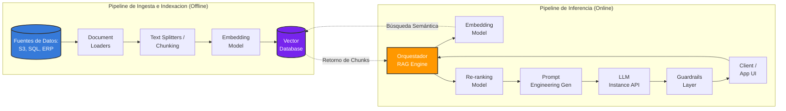

# Guía Técnica: Generación Aumentada por Recuperación (RAG)

---

## 1. Introducción y Fundamentos

### Qué es RAG

**RAG (Retrieval-Augmented Generation)** es un patrón arquitectónico de software que optimiza la salida de un Modelo de Lenguaje Grande (LLM) al consultar una fuente de conocimiento externa y confiable antes de generar una respuesta. En términos técnicos, es un sistema híbrido que combina modelos paramétricos (el conocimiento preentrenado del LLM) con memoria no paramétrica (un almacén de datos externo indexado), transformando el problema de generación de texto puro en un problema de **búsqueda de información orientada a la síntesis**.

### Origen

El concepto fue introducido formalmente por **Lewis et al. (2020)** en su paper de investigación fundamental titulado *"Retrieval-Augmented Generation for Knowledge-Intensive NLP Tasks"*, desarrollado por el equipo de Facebook AI Research (FAIR, ahora Meta AI), la Universidad de Nueva York y University College London. Inicialmente planteado para afinar de extremo a extremo (end-to-end fine-tuning) arquitecturas Sec2Sec (como BART), evolucionó rápidamente hacia la arquitectura desacoplada moderna que domina los sistemas de producción actuales.

### Por qué es importante

Los LLMs puros sufren de tres limitaciones críticas en entornos corporativos:

* **Alucinaciones:** Generación de información falsa o plausible pero incorrecta debido a la naturaleza probabilística del modelo.
* **Falta de conocimiento fresco u oportuno:** El corte de conocimiento (*knowledge cutoff*) congela la memoria paramétrica del modelo en la fecha de finalización de su entrenamiento.
* **Costo e impracticabilidad del Fine-Tuning continuo:** Reentrenar un modelo para inyectarle conocimiento volátil es costoso, lento y propenso al "olvido catastrófico".

RAG resuelve esto inyectando dinámicamente datos relevantes dentro de la ventana de contexto del LLM, limitando su rol al de un motor de razonamiento y síntesis lógica sobre hechos verificables suministrados en tiempo real.

### Beneficios Clave para la Empresa

* **Auditabilidad y Citación de Fuentes:** Permite rastrear el origen exacto de la respuesta generada mapeando los textos recuperados hacia sus documentos fuente, mitigando los riesgos legales y de cumplimiento.
* **Seguridad de Datos y Control de Accesos:** Facilita la aplicación de ACLs (*Access Control Lists*) a nivel de base de datos vectorial; el usuario solo recupera y ve información para la cual tiene permisos explícitos.
* **Eficiencia de Costos y Agilidad:** Modificar el conocimiento del sistema se reduce a añadir, actualizar o borrar registros en una base de datos, lo que elimina los costos computacionales de infraestructura asociados al *fine-tuning*.
* **Privacidad y Aislamiento de Datos:** El conocimiento confidencial de la empresa no se incrusta de forma permanente dentro de los pesos del modelo, minimizando el riesgo de filtración de datos (*data leakage*) a través de ataques de inyección de prompts.

---

## 2. Enfoque Arquitectónico y Fases

### Fases de RAG

Un sistema RAG robusto en producción se divide en dos fases operativas asíncronas y desacopladas:

#### 1. Fase de Ingesta e Indexación (Offline)

Es un pipeline de datos de tipo ETL (*Extract, Transform, Load*) que se ejecuta en segundo plano. Su propósito es estructurar el conocimiento no estructurado. Los documentos se extraen de repositorios de origen (SharePoint, AWS S3, bases de datos SQL/NoSQL), se limpian, se dividen en fragmentos lógicos (*chunks*), se vectorizan a través de un modelo de *embeddings* y finalmente se indexan en un almacén vectorial especializado.

#### 2. Fase de Consulta y Generación (Online)

Es la ruta crítica en tiempo real iniciada por la solicitud del usuario. Cuando ingresa un prompt, el sistema lo vectoriza en milisegundos con el mismo modelo de *embeddings*, ejecuta una búsqueda de similitud sobre la base de datos vectorial, recupera los fragmentos más relevantes, ensambla un súper-prompt enriquecido (*grounded prompt*) y lo envía al LLM para la generación de la respuesta final.

### Componentes Técnicos Base

* **Document Loaders:** Abstracciones encargadas de la ingesta de datos multiformato (PDF, DOCX, HTML, JSON) y de la normalización del texto base, extrayendo metadatos clave (autor, fecha de creación, URL).
* **Text Splitters (Chunkers):** Módulos que segmentan cadenas continuas de texto en bloques más pequeños basados en tokens o caracteres. Son críticos para respetar las limitaciones de la ventana de contexto del LLM y optimizar la granularidad de la información.
* **Embedding Models:** Modelos de redes neuronales profundas (como `text-embedding-3-large` o variantes *open-source* basadas en BERT/Bi-Encoders) que transforman texto en vectores densos de alta dimensionalidad (ejemplo, 1536 dimensiones) que capturan el significado semántico del contenido.
* **Vector Databases:** Motores de bases de datos especializados (como Pinecone, Qdrant, Milvus, pgvector) optimizados para almacenar y consultar vectores a escala utilizando algoritmos de búsqueda del Vecino Más Próximo Aproximado (ANN) como HNSW (Hierarchical Navigable Small World).
* **Large Language Models (LLMs):** El motor cognitivo final (por ejemplo como GPT-4o, Claude 3.5 Sonnet, Llama 3) que procesa el contexto consolidado e instruido mediante ingeniería de prompts para generar respuestas naturales y precisas.

### Técnicas Avanzadas de Arquitectura

* **Chunking de tamaño variable con Overlap:** Configurar una superposición (*overlap*) controlada de tokens entre fragmentos adyacentes para asegurar que la semántica en las fronteras de los bloques no se pierda.
* **Metadata Filtering (Pre-filtering / Post-filtering):** Aplicar filtros estructurados tradicionales (como tags, fechas o IDs de usuario) en conjunto con la búsqueda vectorial para reducir drásticamente el espacio de búsqueda del algoritmo ANN.
* **Re-ranking:** Utilizar un modelo Cross-Encoder secundario y de alta precisión (como Cohere Rerank o BGE-Reranker) después de la recuperación inicial. Este reevalúa la relación par-a-par entre la consulta del usuario y los top-N fragmentos recuperados, reordenándolos para situar la información crítica en la parte superior del contexto, combatiendo el sesgo *"lost in the middle"* del LLM.

---

## 3. Flujo del Proceso (Diagrama y Detalle)

A continuación, se detalla el ciclo de vida completo de una solicitud del usuario a través de la tubería RAG online.

```mermaid
graph LR
    A[Usuario: <br>Envía Query] --> B[API Gateway / <br>Orquestador]
    B --> C[Embedding Model: <br>Vectoriza Query]
    C --> D[Vector DB: <br>Búsqueda Semántica / <br>ANN]
    D --> E[Top-K Chunks <br>Recuperados]
    E --> F[Re-ranker: <br>Reordenamiento <br>Semántico]
    F --> G[Generador de Prompt: <br>Inyección de <br>Contexto]
    G --> H[LLM: <br>Inferencia y <br>Razonamiento]
    H --> I[Orquestador: <br>Post-procesamiento / <br>Guardrails]
    I --> J[Usuario: <br>Recibe Respuesta <br>Sintetizada]

    style A fill:#4CAF50,stroke:#333,stroke-width:2px,color:#fff
    style D fill:#2196F3,stroke:#333,stroke-width:2px,color:#fff
    style H fill:#9C27B0,stroke:#333,stroke-width:2px,color:#fff
    style J fill:#FF9800,stroke:#333,stroke-width:2px,color:#fff

```

### Descripción Detallada del Flujo

1. **Usuario - Envío de Query:** El usuario introduce una consulta en lenguaje natural a través de la interfaz de usuario.
2. **Orquestación inicial:** El orquestador (desarrollado sobre frameworks como LangChain, LlamaIndex o código nativo) recibe la petición, limpia caracteres extraños y sanitiza contra inyecciones básicas.
3. **Generación de Embeddings de Consulta:** El texto limpio de la consulta se envía al modelo de embeddings para convertirse en un vector denso de punto flotante que representa semánticamente la duda del usuario.
4. **Búsqueda en Base de Datos Vectorial:** El vector resultante se envía a la base de datos vectorial. Mediante métricas de distancia (como Similitud Coseno o Distancia Euclidiana), la base de datos localiza de forma ágil los fragmentos indexados más cercanos dentro del espacio vectorial.
5. **Recuperación de los Top-K Chunks:** Se extraen los "K" fragmentos con las puntuaciones de similitud más altas, junto con sus metadatos asociados.
6. **Re-ranking (Opcional pero altamente recomendado):** Los fragmentos recuperados se procesan junto con la consulta original mediante el modelo Re-ranker. Este calcula una puntuación de relevancia más profunda y descarta aquellos fragmentos que, pese a compartir palabras clave, carecen de valor explicativo.
7. **Generación de Prompt Enriquecido:** El orquestador toma la consulta original del usuario, concatena los textos de los fragmentos reordenados y los inserta en una plantilla de prompt estructurada (e.g., *"Responde a la siguiente consulta basándote exclusivamente en el contexto proporcionado..."*).
8. **Inferencia en el LLM:** El prompt consolidado se envía al LLM mediante una llamada de API. El LLM procesa esta información de manera determinista respecto al contexto otorgado.
9. **Post-procesamiento y Guardrails:** La respuesta cruda generada por el LLM pasa por una capa de validación automatizada (como NeMo Guardrails o Llama Guard) para asegurar la ausencia de toxicidad, filtración de datos sensibles o desviaciones de la directriz original.
10. **Entrega al Usuario:** La respuesta final limpia y validada se entrega al usuario final de manera síncrona o mediante *streaming* de tokens.

---

## 4. Arquitectura Base del Sistema (Diagrama y Detalle)

Esta vista lógica representa los componentes de infraestructura y software que dan soporte a los entornos tanto de datos como de inferencia en una arquitectura empresarial RAG.

### Detalle de los Componentes Arquitectónicos

* **Fuentes de Datos (Data Sources):** Almacenes de origen estructurados y no estructurados. Requieren conectores robustos con soporte para flujos de cambio incremental (*Change Data Capture - CDC*) para re-indexar documentos modificados de manera eficiente.
* **Document Loaders & Splitters:** Componentes lógicos distribuidos en servidores de procesamiento (ejemplo, microservicios en Kubernetes o AWS Lambda). Deben manejar de manera eficiente el análisis (*parsing*) sintáctico de formatos complejos como tablas incrustadas en PDFs.
* **Embedding Model Service:** Instancia accesible mediante API de baja latencia. En arquitecturas empresariales de alta concurrencia, suele clonarse el modelo internamente en nubes privadas usando servidores de inferencia como Triton o vLLM para garantizar la privacidad y mantener las latencias bajo control.
* **Vector Database (Almacén Central de Vectores):** Es el corazón que unifica ambos pipelines. Cuenta con un motor de indexación rápido y persistencia desacoplada. Se segmenta mediante espacios de nombres (*namespaces*) o metadatos para segmentar datos según los inquilinos o áreas de negocio corporativas (*multi-tenancy*).
* **Orquestador de Aplicación:** Capa de lógica de negocio que gestiona el estado de la sesión, coordina las llamadas asíncronas hacia las bases de datos vectoriales y el backend de IA, e implementa estrategias de memoria conversacional (historial del chat).
* **Servicio de Re-ranking:** Generalmente es un endpoint dedicado de alto poder de procesamiento optimizado para cargas de GPU, debido al costo computacional superior que implica el uso de modelos Cross-Encoder sobre arquitecturas masivas de datos.
* **LLM Runtime (Instancia de Inferencia LLM):** El endpoint que aloja los modelos fundacionales. Puede ser un servicio administrado (Azure OpenAI, AWS Bedrock) o infraestructura autogestionada que garantice políticas estrictas de acuerdos de nivel de servicio (*SLAs*) en tiempos de primer token (*Time To First Token - TTFT*).
* **Capa de Guardrails:** Capa de seguridad por software que intercepta la entrada y la salida para el control de riesgos de alineación de IA y cumplimiento corporativo.

---

## 5. Justificación Tecnológica (Por qué utilizar RAG)

Para justificar la selección de RAG en la arquitectura empresarial, es necesario contrastarla frente a las otras metodologías principales de adaptación de conocimiento:

| Dimensión Técnica / Operativa | RAG (Generación Aumentada) | Fine-Tuning (Ajuste Fino) | Context Stuffing (Inyección Manual) |
| --- | --- | --- | --- |
| **Costo de Implementación** | **Bajo a Moderado:** Costo de almacenamiento vectorial y tokens de inferencia. | **Alto:** Requiere infraestructura masiva de GPUs y talento especializado en data science. | **Bajo:** No requiere infraestructura adicional. |
| **Costo por Consulta (Inferencia)** | **Moderado:** Agrega tokens de contexto optimizados a la llamada del LLM. | **Bajo:** El modelo ya cuenta con el conocimiento integrado en sus pesos sin agregar contexto extra. | **Muy Alto:** El prompt crece de forma masiva en cada consulta al enviar documentos enteros. |
| **Actualización de Conocimiento** | **Tiempo Real (Milisegundos):** Basta con insertar un nuevo vector en la base de datos. | **Lento (Horas/Días):** Exige ejecutar un nuevo ciclo de entrenamiento por lotes. | **Dinámico (Por consulta):** Limitado exclusivamente a lo que quepa en el prompt manual actual. |
| **Riesgo de Alucinación** | **Mínimo:** El modelo es guiado explícitamente a restringirse al contexto proporcionado. | **Moderado a Alto:** El modelo sigue operando de forma probabilística sobre sus pesos modificados. | **Bajo a Moderado:** Si el contexto es excesivo, el LLM tiende a omitir detalles (*lost in the middle*). |
| **Auditabilidad de Fuentes** | **Directa:** Mapeo unívoco entre el vector devuelto y el documento origen en la base de datos vectorial. | **Imposible:** El conocimiento está difuso y distribuido dentro de los pesos neuronales del modelo. | **Directa:** Los datos están explícitamente en el prompt, pero carece de un sistema formal de ordenamiento. |
| **Control de Accesos Corporativos (ACL)** | **Nativo y Simple:** Se resuelve a través de filtros estructurados por metadatos a nivel de consulta vectorial. | **Complejo / Inviable:** Se tendría que entrenar un modelo diferente por cada perfil de acceso de la empresa. | **Manual:** Requiere filtrado programático previo de toda la data en la capa lógica de la aplicación. |

---

## 6. Resumen y Referencias

### Resumen

La arquitectura RAG se ha consolidado como el estándar de la industria de software para conectar los datos propietarios de las organizaciones con el potencial cognitivo de los Modelos de Lenguaje Grande. Al separar eficientemente el almacenamiento del conocimiento (memoria no paramétrica) del procesamiento del lenguaje (memoria paramétrica), los sistemas RAG ofrecen una solución escalable, auditable y sumamente costo-eficiente frente a los desafíos inherentes de las alucinaciones de los LLMs. El futuro técnico de RAG se encamina hacia sistemas de tipo **GraphRAG** (combinación con gráficos de conocimiento para relaciones complejas) y **Sistemas Agénticos**, donde agentes inteligentes deciden autónomamente qué herramientas y qué fuentes de información consultar antes de responder.

### Referencias

* **Paper Base del Concepto:** Lewis, P., Perez, E., Piktus, A., Petroni, F., Lewis, M., Riedel, S., & Kiela, D. (2020). *Retrieval-Augmented Generation for Knowledge-Intensive NLP Tasks*. Advances in Neural Information Processing Systems, 33, 9459-9474. [arXiv:2005.11401](https://arxiv.org/abs/2005.11401)
* **Estudio sobre el impacto del orden del contexto:** Liu, N. F., Lin, K., Hewitt, J., Paranjape, A., Bevilacqua, M., Petroni, F., & Liang, P. (2023). *Lost in the Middle: How Language Models Use Long Contexts*. [arXiv:2307.03172](https://arxiv.org/abs/2307.03172)
* **Frameworks y Ecosistema de Desarrollo:**
* *LangChain:* [https://github.com/langchain-ai/langchain](https://github.com/langchain-ai/langchain)
* *LlamaIndex:* [https://github.com/run-llama/llama_index](https://github.com/run-llama/llama_index)

---

*Documentación [v1.0.0] elaborado por [Hadson Paredes](https://www.linkedin.com/in/hadson-paredes/) - 2026*

Publicaciones en mis redes sociales y repositorio GitHub 
<strong>Sígueme en mis redes sociales</strong>  
  
  
  
  

